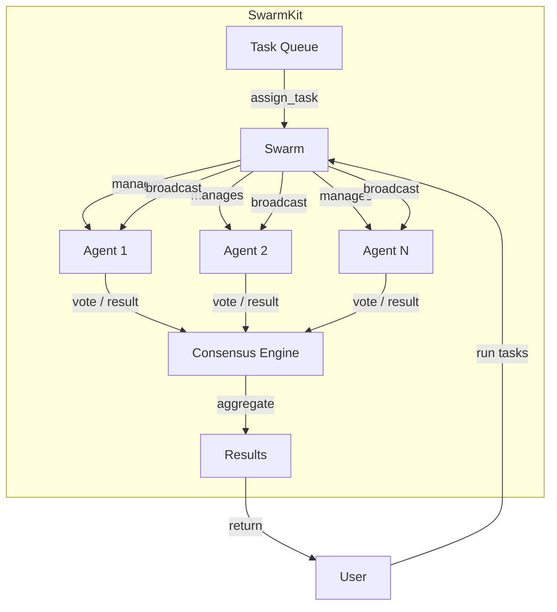

# SwarmKit 🐝

[](https://github.com/MukundaKatta/SwarmKit/actions/workflows/ci.yml)
[](https://www.python.org/downloads/)
[](https://opensource.org/licenses/MIT)
[](https://pypi.org/project/swarmkit/)

**A Python framework for creating and orchestrating swarms of AI agents that collaborate to solve complex tasks.**

Inspired by multi-agent AI trends but focused on swarm-based coordination patterns — consensus, voting, broadcasting, and emergent task assignment.

---

## Architecture



## Features

- **Swarm Coordination** — manage groups of agents with shared goals
- **Task Matching** — automatically assign tasks to the best-fit agents based on capabilities
- **Voting & Consensus** — built-in algorithms for collective decision-making
- **Async-First** — fully asynchronous with `asyncio` for concurrent agent execution
- **Broadcasting** — send messages to all agents simultaneously
- **Result Aggregation** — collect and merge results from distributed agent work
- **Pydantic Models** — type-safe configuration and validation throughout

## Quickstart

### Installation

```bash
pip install swarmkit
```

Or install from source:

```bash
git clone https://github.com/MukundaKatta/SwarmKit.git
cd SwarmKit
pip install -e ".[dev]"
```

### Basic Usage

```python
import asyncio
from swarmkit import Agent, Task, Swarm

async def main():
    # Create agents with different capabilities
    researcher = Agent(name="Researcher", role="research", capabilities=["search", "summarize"])
    writer = Agent(name="Writer", role="content", capabilities=["write", "edit"])
    reviewer = Agent(name="Reviewer", role="qa", capabilities=["review", "validate"])

    # Build a swarm
    swarm = Swarm(agents=[researcher, writer, reviewer])

    # Define tasks
    tasks = [
        Task(description="Research the topic", requirements=["search"]),
        Task(description="Write the article", requirements=["write"]),
        Task(description="Review the output", requirements=["review"]),
    ]

    # Run the swarm
    results = await swarm.run(tasks)
    for result in results:
        print(f"[{result['agent']}] {result['task']} → {result['status']}")

asyncio.run(main())
```

### Voting & Consensus

```python
async def decide():
    swarm = Swarm(agents=[
        Agent(name="A1", role="voter", capabilities=["decide"]),
        Agent(name="A2", role="voter", capabilities=["decide"]),
        Agent(name="A3", role="voter", capabilities=["decide"]),
    ])

    # Simple majority vote
    winner = await swarm.vote(options=["Option A", "Option B", "Option C"])
    print(f"Winner: {winner}")

    # Consensus with proposals
    result = await swarm.consensus(proposals=["Plan X", "Plan Y"])
    print(f"Consensus: {result}")

asyncio.run(decide())
```

## Development

```bash
make install    # Install with dev dependencies
make test       # Run tests
make lint       # Run linters
make format     # Format code
```

## Documentation

- [Architecture](docs/ARCHITECTURE.md)
- [Contributing](CONTRIBUTING.md)

## License

MIT — see [LICENSE](LICENSE) for details.

---

**Built by Officethree Technologies | Made with ❤️ and AI**
